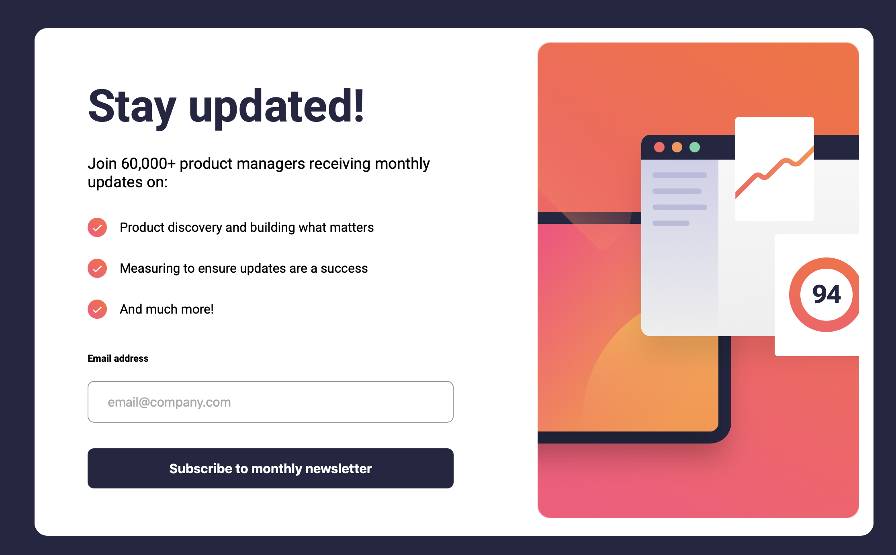
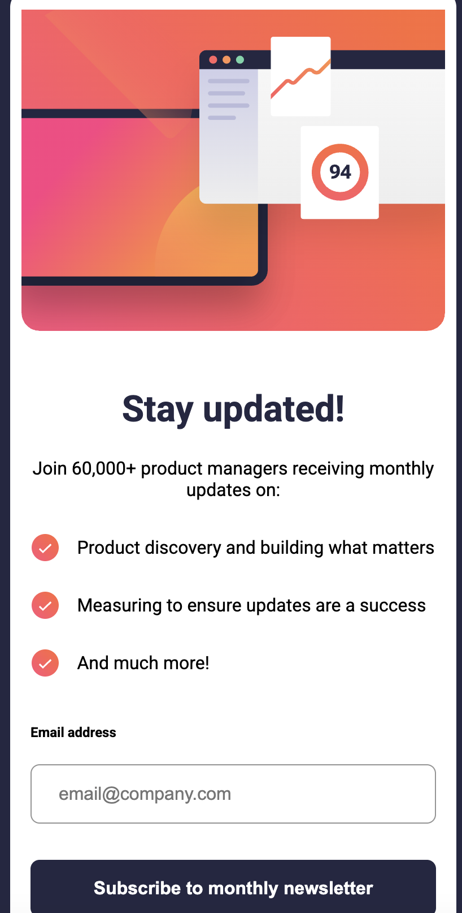

## Table of contents
- [Overview](#overview)
  - [Screenshot](#screenshot)
  - [Links](#links)
- [My process](#my-process)
  - [Built with](#built-with)
- [Author](#author)

## Overview

### Screenshot
  

### Links
- Solution URL: [GitHub Repository](https://github.com/Lodin03/newsletter-sign-up)
- Live Site URL: [Live Preview](https://lodin03.github.io/newsletter-sign-up/)

## My process

### Built with

- Semantic HTML5 markup
- Flexbox for layout
- JavaScript for interactivity
- Mobile-first workflow
- BEM-style class naming
- Responsive design principles (example: clamp(), media queries)
- SCSS (Sass) for structured styling

## Author

- GitHub - [Lodin03](https://github.com/Lodin03)
- LinkedIn - [Lars Odin Tveit Moen](https://www.linkedin.com/in/lars-odin-tveit-moen-736600260/)

